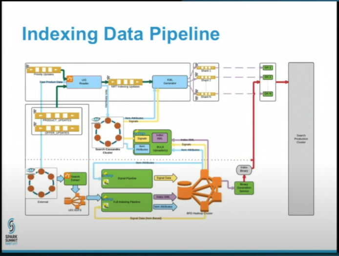
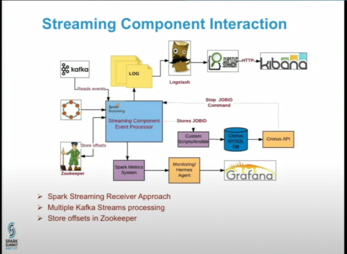
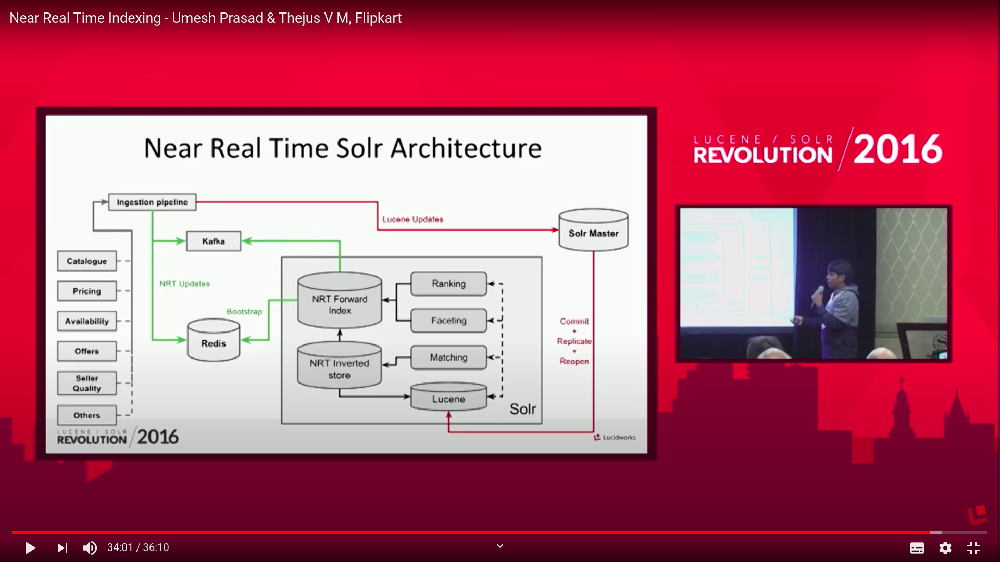

# Remaining Implementation

## near real time search using the elastic search and cassandra database

[walmart real time search]([https://link](https://www.youtube.com/watch?v=Zn_VLquu_hc))

[Learnings Using Spark Streaming and DataFrames for Walmart Search: by Nirmal Sharma and Yan Zheng](https://www.youtube.com/watch?v=YPyrTWGXyf4&list=RDCMUCRzsq7k4-kT-h3TDUBQ82-w&index=20)

in this scenario walmart store all the store in the cassandra database and prepose it using the apache spark and create new indexing and store it in the elastic search database.

in walmart this processing is called as the lambda processing.

## flipkart real time search results

### important links

[Near Real Time Indexing - Umesh Prasad & Thejus V M, Flipkart](https://www.youtube.com/watch?v=05rX0mJ2N4U)

[Improving product discovery via relevance and ranking optimization - Akash Khandelwal](https://www.youtube.com/watch?v=kdMyLDb6pP4)

[flipkart product catalog](https://www.youtube.com/watch?v=2dfpUO6KazY)

### Contition for implementing real time search

1. minimun latency ex 100ms
2. implement using elastic search and cassandra database

#### problems

1. elastic search is made for real time search not for the database storage.

2. Cassandra is made for high writes and read for the dame time.

3. thus we have to implements the walmart logic first we have to store the in the cassandra database and the make indexing using apache spark preprosiing and streaming using apache kafka.

4. and the these proocessed data is used for indexing.

